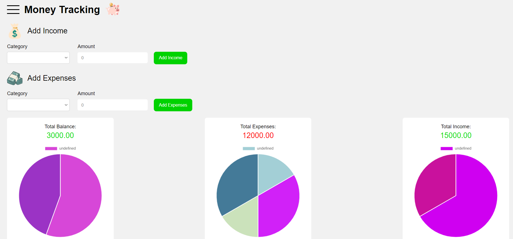
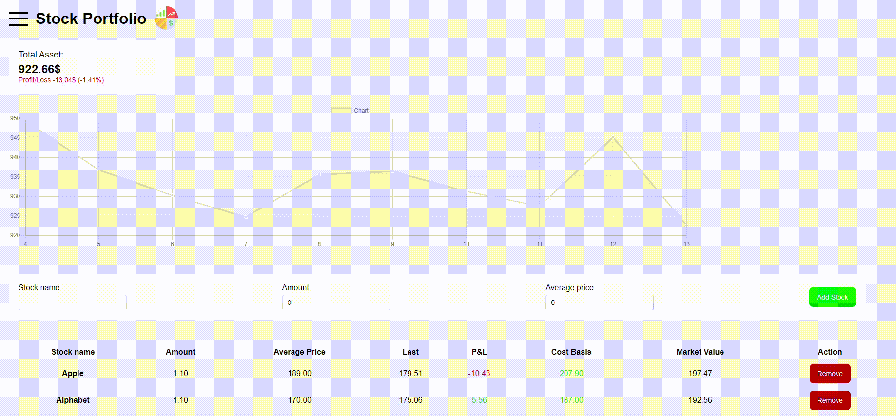

# 2 Single Pages App with F#

This is a Single Page Application built using F# and WebSharper. First page is about Money Tracking, users can input their income, expenses and see the total balance. Second page is about managing Stock Portfolio, users can add and remove Stock which contain stock name, stock average price, etc.

## Landing Page

- This is the first page (Money Tracking page)



- This is the second page (Stock Portfolio Page)
  



## Technologies used

- [F#](https://fsharp.org)
- [WebSharper](https://websharper.com)
- [ASP.NET Core](https://dotnet.microsoft.com/en-us/apps/aspnet)

## Preview

You can see a live preview of the website [here](https://got17.github.io/Single-Page-App/).

## Project Structure

- **Client.fs**: Client-side code and contains the logical code of the web pages.
- **Startup.fs**: Server-side code.
- **wwwroot/index.html**: The main HTML file
- **wwwroot/Content/styles.css**: Styles for each web page.
- **wwwroot/Images**: Images used in the website.
- **MySPA.fsproj**: Project file.

## Getting Started

To get a local copy up and running follow these simple steps.

### Prerequisites

Before you start, ensure you have the following installed:

- [.NET Core SDK](https://dotnet.microsoft.com/download)
- [Node.js](https://nodejs.org/)

### Installation

1. Clone the repo
   ```sh
   git clone https://github.com/Got17/Single-Page-App.git
   ```
2. Navigate to the project directory
   ```sh
   cd Single-Page-App
   ```
### Usage

1. Open the project in your favorite code editor.
2. Build the project using the following command:
   ```sh
   dotnet build
   ```
3. Run the project:
   ```sh
   dotnet run
   ```
4. Open your web browser and navigate to [http://localhost:5000](http://localhost:5000) to view the application.

## Contributing

Contributions are what make the open-source community such an amazing place to learn, inspire, and create. Any contributions you make are **greatly appreciated**.

1. Fork the Project
2. Create your Feature Branch (`git checkout -b feature/AmazingFeature`)
3. Commit your Changes (`git commit -m 'Add some AmazingFeature`)
4. Push to the Branch (`git push origin feature/AmazingFeature`)
5. Open a Pull Request
